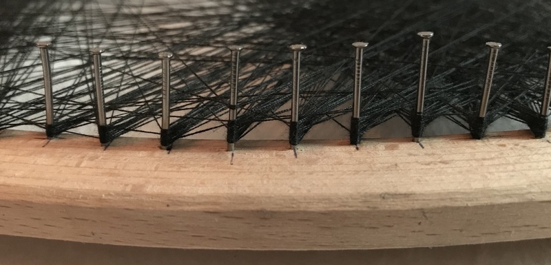

# Python implementation of Petros Vrellis' "A New Way to Knit"

This (rough) python script is a means to reproduce the images created by Petrol Vrellis "A New Way to Knit":

[http://artof01.com/vrellis/works/knit.html](http://artof01.com/vrellis/works/knit.html)

Have a look at my [blog article](https://sim-on.github.io/2017/07/26/hula/) to see how it works!

The script accepts the following parameters:

| Flag | Default | Description |
| --- | --- | --- |
| `i` | n/a | input file, use a square image |
| `n` | 200 | number of pins |
| `s` | 400px | size of the output image |
| `t` | 1000 | number of threads, as in physical threads, not those in parallel computing ;) |
| `m` | 20 | minimum distance between subsequent pins |

The output image is written to `out.png`, the list of pins is written to `points.txt`.